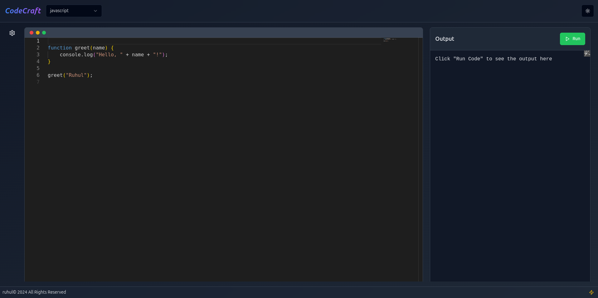

# Online Code Editor

This is an online code editor that supports multiple programming languages.

## Features

- Multiple language support
- Code editing with syntax highlighting
- Customizable editor settings

### Overview




## Setup

```bash
# clone the repository
  git clone https://github.com/yusukebe/online-code-editor.git
  cd online-code-editor
```

```bash
  # copy the .env.example file to .env and set the environment variables
  cp .env.example .env
```

```bash
  # install dependencies
  npm install
```

```bash
  # run the app
  npm run dev
```
